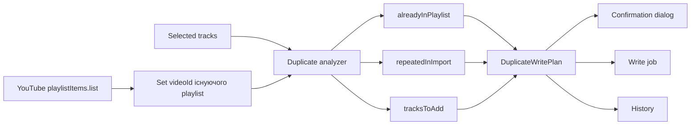

# v1.2.0 — Дані перевірки

```mermaid
flowchart LR
    API[YouTube playlistItems.list]
    --> IDS[Set videoId існуючого playlist]

    IMPORT[Selected tracks]
    --> ANALYZER[Duplicate analyzer]

    IDS --> ANALYZER

    ANALYZER --> EXIST[alreadyInPlaylist]
    ANALYZER --> REPEAT[repeatedInImport]
    ANALYZER --> NEW[tracksToAdd]

    EXIST --> PLAN[DuplicateWritePlan]
    REPEAT --> PLAN
    NEW --> PLAN

    PLAN --> UI[Confirmation dialog]
    PLAN --> WRITE[Write job]
    PLAN --> HISTORY[History]
```
