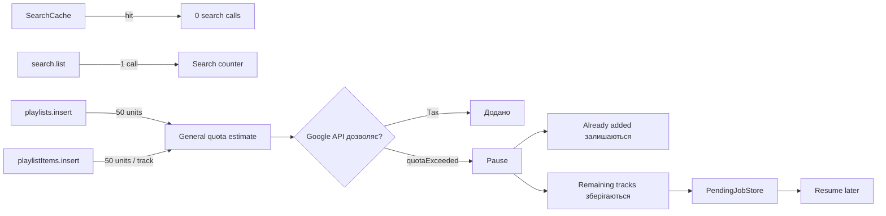
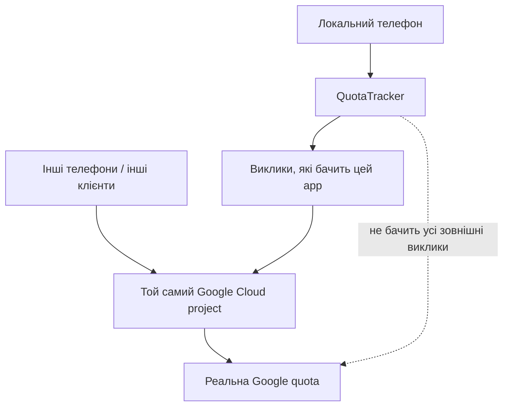

# v1.2.0 — Квота і Pending Queue

```mermaid
flowchart LR
    A[SearchCache]
    -->|hit| B[0 search calls]
    C[search.list]
    -->|1 call| D[Search counter]

    E[playlists.insert]
    -->|50 units| F[General quota estimate]
    G[playlistItems.insert]
    -->|50 units / track| F

    F --> H{Google API дозволяє?}
    H -- Так --> I[Додано]
    H -- quotaExceeded --> J[Pause]

    J --> K[Already added залишаються]
    J --> L[Remaining tracks зберігаються]
    L --> M[PendingJobStore]
    M --> N[Resume later]
```

## Межа точності

```mermaid
flowchart TD
    A[Локальний телефон]
    --> B[QuotaTracker]
    B --> C[Виклики, які бачить цей app]

    D[Інші телефони / інші клієнти]
    --> E[Той самий Google Cloud project]

    C --> E

    E --> F[Реальна Google quota]
    B -. не бачить усі зовнішні виклики .-> F
```
