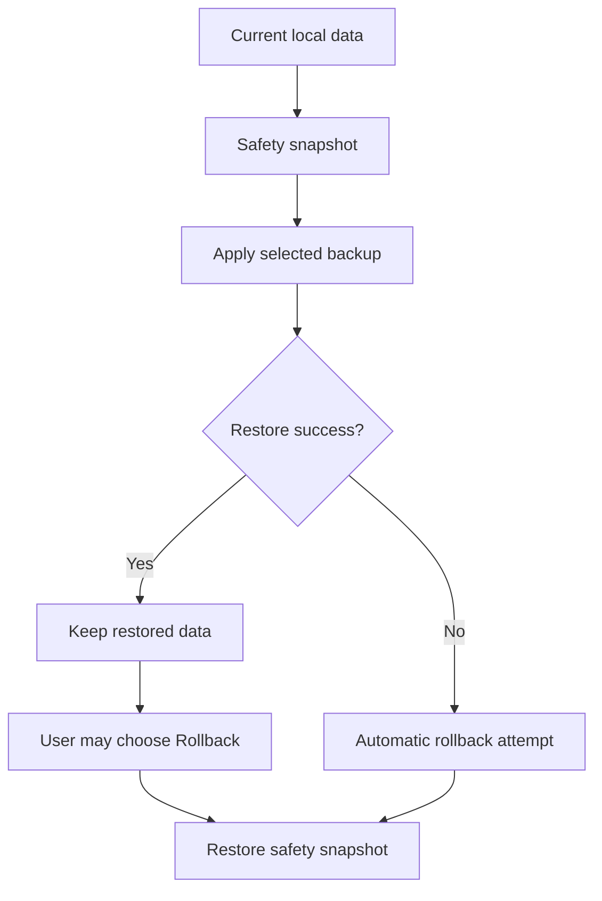

# v1.2.0 — Restore rollback

```mermaid
flowchart TD
    A[Current local data]
    --> B[Safety snapshot]
    B --> C[Apply selected backup]
    C --> D{Restore success?}

    D -- Yes --> E[Keep restored data]
    E --> F[User may choose Rollback]
    F --> G[Restore safety snapshot]

    D -- No --> H[Automatic rollback attempt]
    H --> G
```
