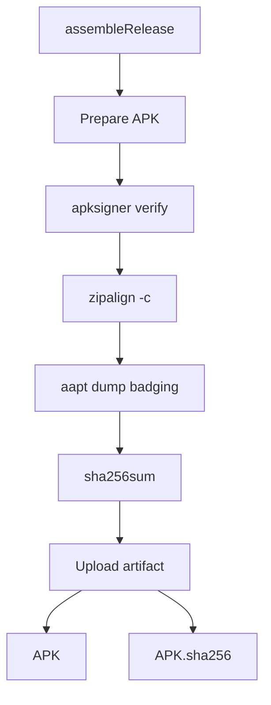

# v1.2.1 — APK verification

```mermaid
flowchart TD
    A[assembleRelease]
    --> B[Prepare APK]
    --> C[apksigner verify]
    --> D[zipalign -c]
    --> E[aapt dump badging]
    --> F[sha256sum]
    --> G[Upload artifact]
    G --> H[APK]
    G --> I[APK.sha256]
```
