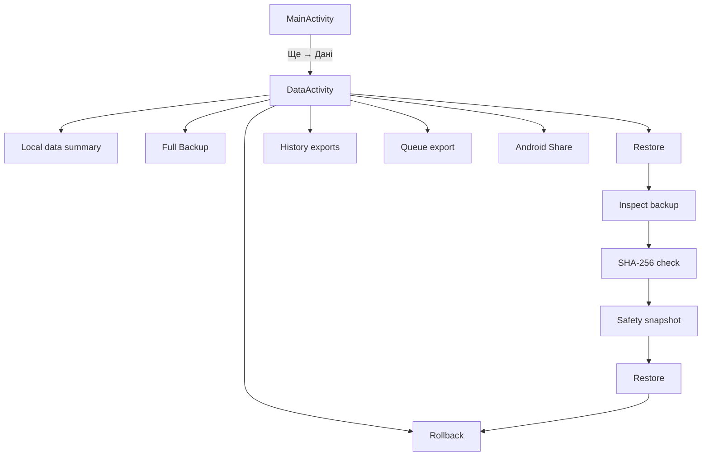

# v1.2.1 — Data screen flow

```mermaid
flowchart TD
    A[MainActivity]
    -->|Ще → Дані| B[DataActivity]

    B --> C[Local data summary]
    B --> D[Full Backup]
    B --> E[Restore]
    B --> F[Rollback]
    B --> G[History exports]
    B --> H[Queue export]
    B --> I[Android Share]

    E --> J[Inspect backup]
    J --> K[SHA-256 check]
    K --> L[Safety snapshot]
    L --> M[Restore]
    M --> F
```
