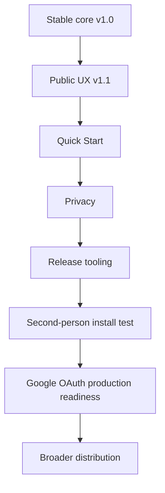

# v1.2.1 — Public release readiness

```mermaid
flowchart TD
    A[Stable core v1.0]
    --> B[Public UX v1.1]
    --> C[Quick Start]
    --> D[Privacy]
    --> E[Release tooling]
    --> F[Second-person install test]
    --> G[Google OAuth production readiness]
    --> H[Broader distribution]
```
