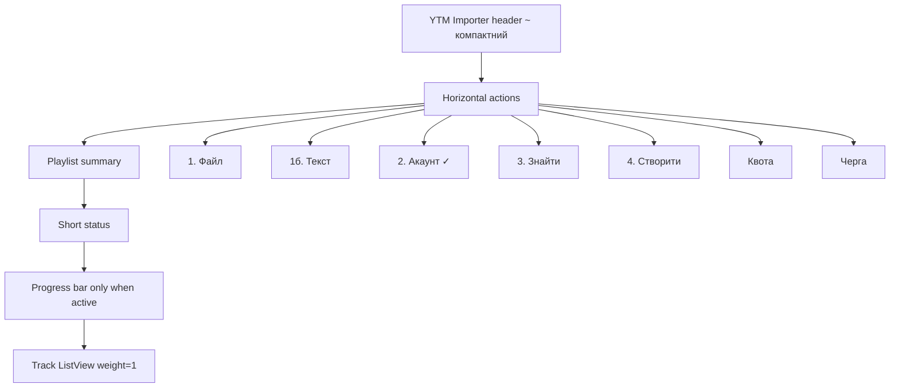

# v1.2.1 — UI layout (структура екрана)

```mermaid
flowchart TD
    A[YTM Importer header ~ компактний]
    --> B[Horizontal actions]
    --> C[Playlist summary]
    --> D[Short status]
    --> E[Progress bar only when active]
    --> F[Track ListView weight=1]

    B --> B1[1. Файл]
    B --> B2[1б. Текст]
    B --> B3[2. Акаунт ✓]
    B --> B4[3. Знайти]
    B --> B5[4. Створити]
    B --> B6[Квота]
    B --> B7[Черга]
```

`ListView` залишається з `layout_weight = 1`, тому отримує весь вільний вертикальний простір.
