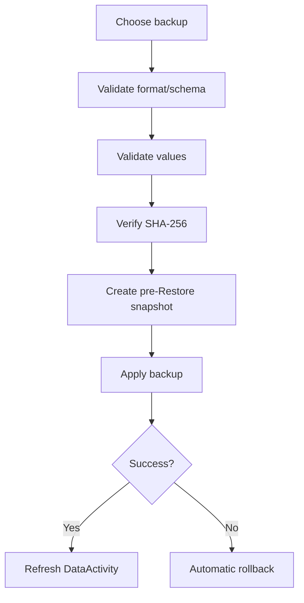

# v1.2.2 — Backup safety

```mermaid
flowchart TD
    A[Choose backup]
    --> B[Validate format/schema]
    --> C[Validate values]
    --> D[Verify SHA-256]
    --> E[Create pre-Restore snapshot]
    --> F[Apply backup]

    F --> G{Success?}
    G -- Yes --> H[Refresh DataActivity]
    G -- No --> I[Automatic rollback]
```
