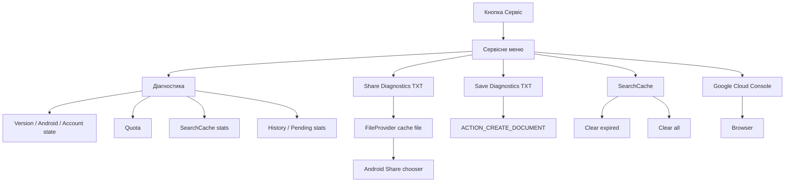

# v1.2.2 — Diagnostics flow

```mermaid
flowchart TD
    A[Кнопка Сервіс]
    --> B[Сервісне меню]

    B --> C[Діагностика]
    C --> D[Version / Android / Account state]
    C --> E[Quota]
    C --> F[SearchCache stats]
    C --> G[History / Pending stats]

    B --> H[Share Diagnostics TXT]
    H --> I[FileProvider cache file]
    I --> J[Android Share chooser]

    B --> K[Save Diagnostics TXT]
    K --> L[ACTION_CREATE_DOCUMENT]

    B --> M[SearchCache]
    M --> N[Clear expired]
    M --> O[Clear all]

    B --> P[Google Cloud Console]
    P --> Q[Browser]
```
