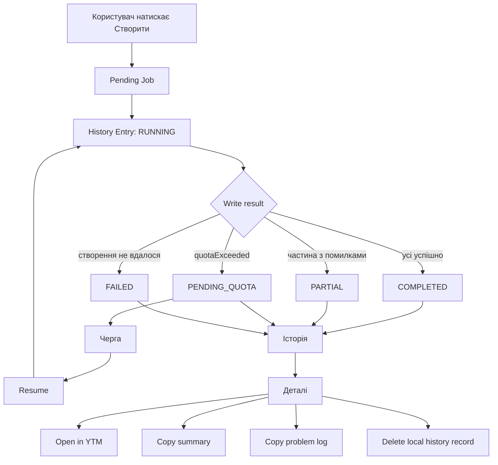

# v1.2.2 — Історія операцій

```mermaid
flowchart TD
    A[Користувач натискає Створити]
    --> B[Pending Job]
    --> C[History Entry: RUNNING]

    C --> D{Write result}

    D -->|усі успішно| E[COMPLETED]
    D -->|частина з помилками| F[PARTIAL]
    D -->|quotaExceeded| G[PENDING_QUOTA]
    D -->|створення не вдалося| H[FAILED]

    G --> I[Черга]
    I --> J[Resume]
    J --> C

    E --> K[Історія]
    F --> K
    G --> K
    H --> K

    K --> L[Деталі]
    L --> M[Open in YTM]
    L --> N[Copy summary]
    L --> O[Copy problem log]
    L --> P[Delete local history record]
```
