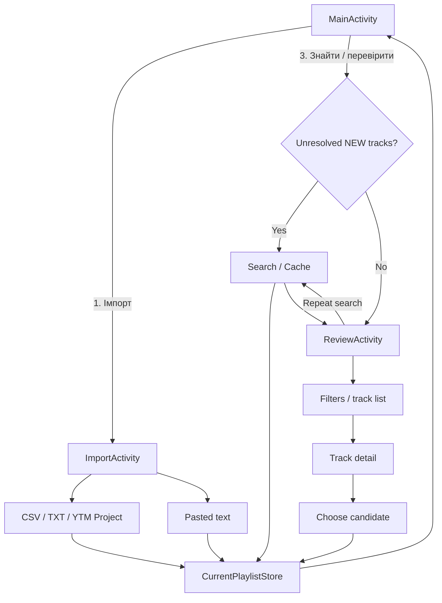

# v1.3.0 — Import / Review flow

```mermaid
flowchart TD
    A[MainActivity]
    -->|1. Імпорт| B[ImportActivity]

    B --> C[CSV / TXT / YTM Project]
    B --> D[Pasted text]
    C --> E[CurrentPlaylistStore]
    D --> E
    E --> A

    A -->|3. Знайти / перевірити| F{Unresolved NEW tracks?}
    F -- Yes --> G[Search / Cache]
    G --> E
    G --> H[ReviewActivity]
    F -- No --> H

    H --> I[Filters / track list]
    I --> J[Track detail]
    J --> K[Choose candidate]
    K --> E
    H -->|Repeat search| G
```
