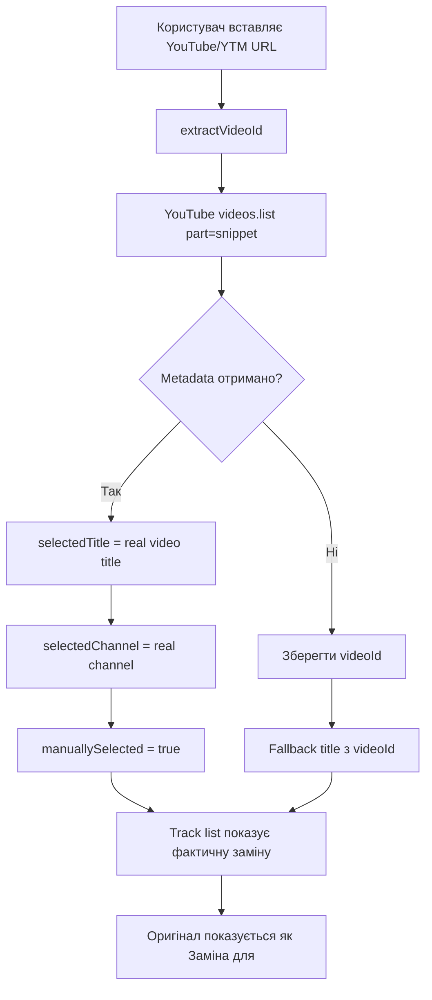

# v1.3.0 — Ручне посилання

```mermaid
flowchart TD
    A[Користувач вставляє YouTube/YTM URL]
    --> B[extractVideoId]
    --> C[YouTube videos.list part=snippet]
    --> D{Metadata отримано?}

    D -- Так --> E[selectedTitle = real video title]
    E --> F[selectedChannel = real channel]
    F --> G[manuallySelected = true]
    G --> H[Track list показує фактичну заміну]
    H --> I[Оригінал показується як Заміна для]

    D -- Ні --> J[Зберегти videoId]
    J --> K[Fallback title з videoId]
    K --> H
```
