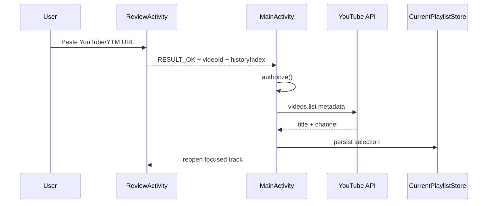

# v1.3.0 — Manual URL metadata flow

```mermaid
sequenceDiagram
    participant U as User
    participant R as ReviewActivity
    participant M as MainActivity
    participant Y as YouTube API
    participant S as CurrentPlaylistStore

    U->>R: Paste YouTube/YTM URL
    R-->>M: RESULT_OK + videoId + historyIndex
    M->>M: authorize()
    M->>Y: videos.list metadata
    Y-->>M: title + channel
    M->>S: persist selection
    M->>R: reopen focused track
```
