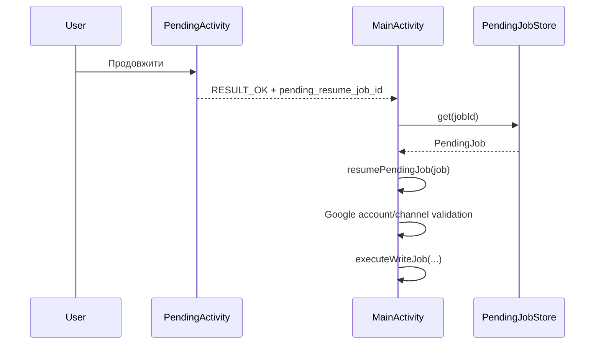

# v1.3.0 — Resume contract

```mermaid
sequenceDiagram
    participant U as User
    participant P as PendingActivity
    participant M as MainActivity
    participant S as PendingJobStore

    U->>P: Продовжити
    P-->>M: RESULT_OK + pending_resume_job_id
    M->>S: get(jobId)
    S-->>M: PendingJob
    M->>M: resumePendingJob(job)
    M->>M: Google account/channel validation
    M->>M: executeWriteJob(...)
```

Resume/write logic remains centralized in MainActivity.
