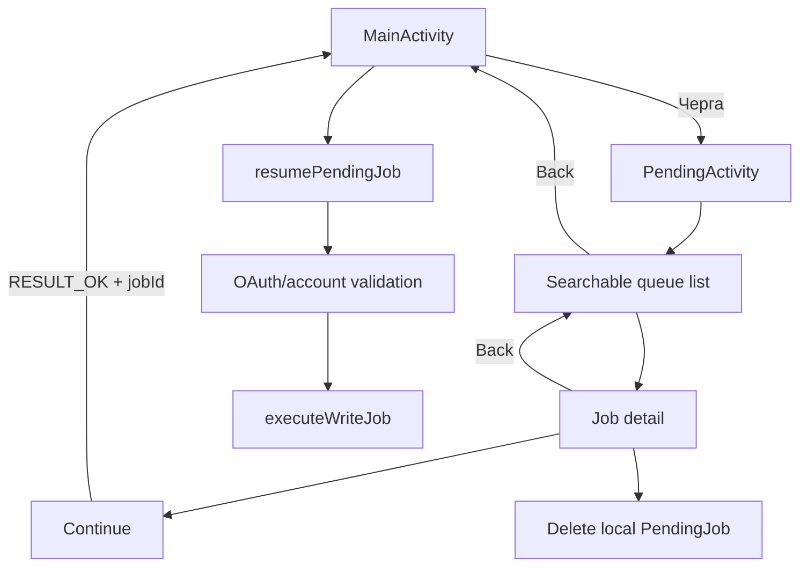

# v1.3.0 — Pending Queue screen

```mermaid
flowchart TD
    A[MainActivity]
    -->|Черга| B[PendingActivity]

    B --> C[Searchable queue list]
    C --> D[Job detail]

    D -->|Back| C
    C -->|Back| A

    D --> E[Continue]
    E -->|RESULT_OK + jobId| A
    A --> F[resumePendingJob]
    F --> G[OAuth/account validation]
    G --> H[executeWriteJob]

    D --> I[Delete local PendingJob]
```
