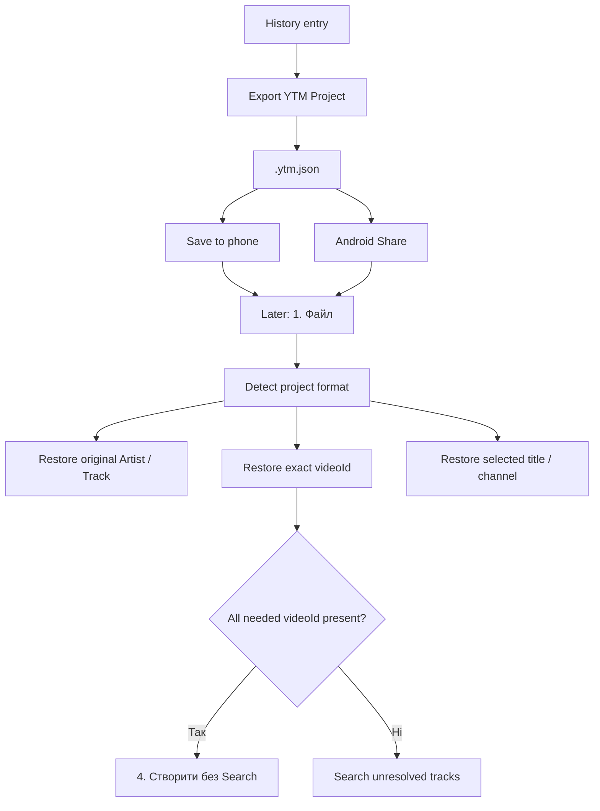

# v1.3.0 — Playlist Project

```mermaid
flowchart TD
    A[History entry]
    --> B[Export YTM Project]

    B --> C[.ytm.json]
    C --> D[Save to phone]
    C --> E[Android Share]

    D --> F[Later: 1. Файл]
    E --> F

    F --> G[Detect project format]
    G --> H[Restore original Artist / Track]
    G --> I[Restore exact videoId]
    G --> J[Restore selected title / channel]

    I --> K{All needed videoId present?}
    K -- Так --> L[4. Створити без Search]
    K -- Ні --> M[Search unresolved tracks]
```
