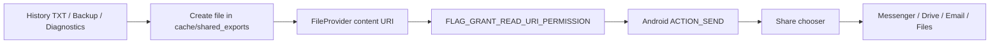

# v1.3.0 — Android Share

```mermaid
flowchart LR
    A[History TXT / Backup / Diagnostics]
    --> B[Create file in cache/shared_exports]
    --> C[FileProvider content URI]
    --> D[FLAG_GRANT_READ_URI_PERMISSION]
    --> E[Android ACTION_SEND]
    --> F[Share chooser]
    --> G[Messenger / Drive / Email / Files]
```

Файл не відкривається назовні як прямий filesystem path.
Інший застосунок отримує тимчасовий `content://` URI.
