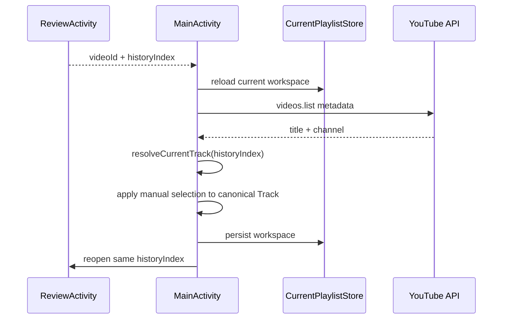

# v1.3.1 — Manual selection canonical-track flow

```mermaid
sequenceDiagram
    participant R as ReviewActivity
    participant M as MainActivity
    participant S as CurrentPlaylistStore
    participant Y as YouTube API

    R-->>M: videoId + historyIndex
    M->>S: reload current workspace
    M->>Y: videos.list metadata
    Y-->>M: title + channel
    M->>M: resolveCurrentTrack(historyIndex)
    M->>M: apply manual selection to canonical Track
    M->>S: persist workspace
    M->>R: reopen same historyIndex
```
