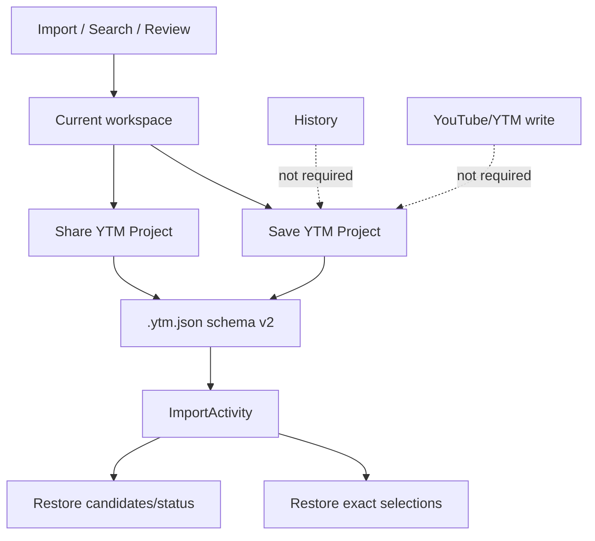

# v1.3.1 — Working YTM Project

```mermaid
flowchart TD
    A[Import / Search / Review]
    --> B[Current workspace]
    B --> C[Save YTM Project]
    B --> D[Share YTM Project]

    C --> E[.ytm.json schema v2]
    D --> E

    E --> F[ImportActivity]
    F --> G[Restore exact selections]
    F --> H[Restore candidates/status]

    I[History] -. not required .-> C
    J[YouTube/YTM write] -. not required .-> C
```
