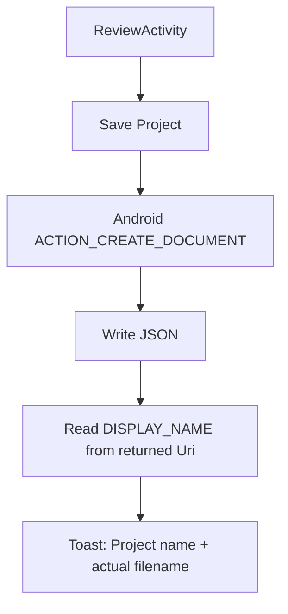

# v1.3.2 — Project save feedback

```mermaid
flowchart TD
    A[ReviewActivity]
    --> B[Save Project]
    --> C[Android ACTION_CREATE_DOCUMENT]
    --> D[Write JSON]
    --> E[Read DISPLAY_NAME from returned Uri]
    --> F[Toast: Project name + actual filename]
```
