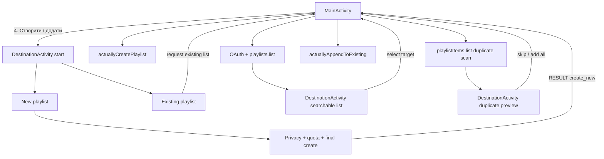

# v1.4.0 — Destination screen flow

```mermaid
flowchart TD
    A[MainActivity]
    -->|4. Створити / додати| B[DestinationActivity start]

    B --> C[New playlist]
    B --> D[Existing playlist]

    C --> E[Privacy + quota + final create]
    E -->|RESULT create_new| A
    A --> F[actuallyCreatePlaylist]

    D -->|request existing list| A
    A --> G[OAuth + playlists.list]
    G --> H[DestinationActivity searchable list]
    H -->|select target| A
    A --> I[playlistItems.list duplicate scan]
    I --> J[DestinationActivity duplicate preview]
    J -->|skip / add all| A
    A --> K[actuallyAppendToExisting]
```
