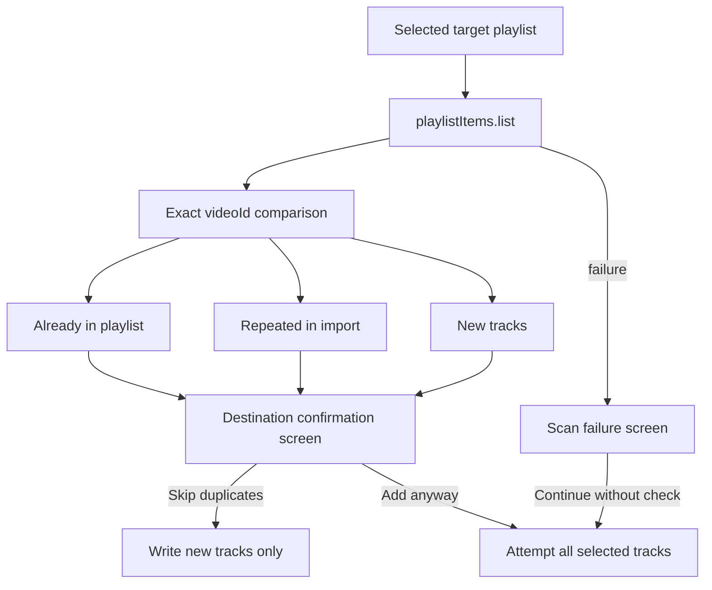

# v1.4.0 — Existing playlist duplicate confirmation

```mermaid
flowchart TD
    A[Selected target playlist]
    --> B[playlistItems.list]
    --> C[Exact videoId comparison]

    C --> D[Already in playlist]
    C --> E[Repeated in import]
    C --> F[New tracks]

    D --> G[Destination confirmation screen]
    E --> G
    F --> G

    G -->|Skip duplicates| H[Write new tracks only]
    G -->|Add anyway| I[Attempt all selected tracks]

    B -->|failure| J[Scan failure screen]
    J -->|Continue without check| I
```
