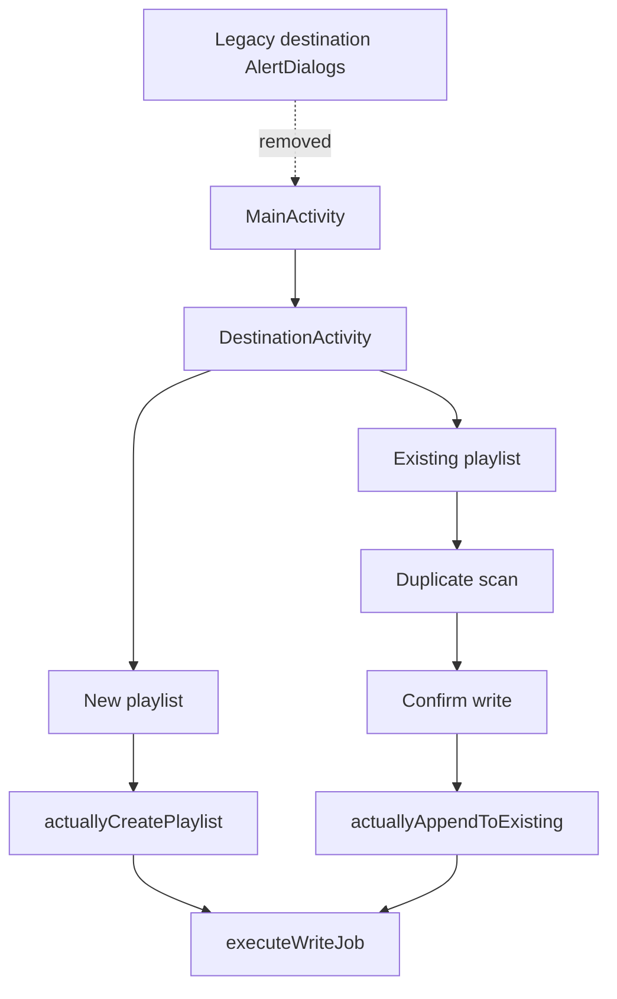

# v1.4.1 — Destination cleanup

```mermaid
flowchart TD
    M[MainActivity]
    --> D[DestinationActivity]

    D --> N[New playlist]
    D --> E[Existing playlist]
    E --> X[Duplicate scan]
    X --> C[Confirm write]

    N --> W1[actuallyCreatePlaylist]
    C --> W2[actuallyAppendToExisting]

    W1 --> CORE[executeWriteJob]
    W2 --> CORE

    OLD[Legacy destination AlertDialogs]
    -. removed .-> M
```
