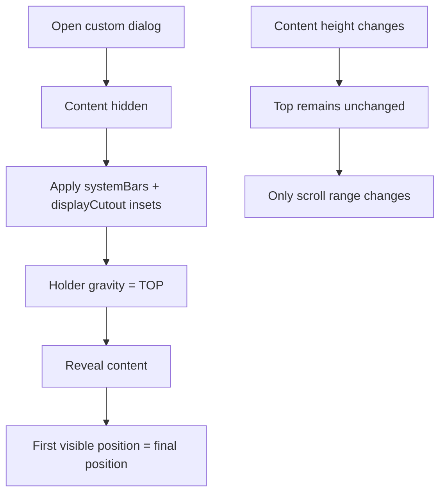

# v1.4.10 — Stable custom dialog anchor

```mermaid
flowchart TD
    A[Open custom dialog]
    --> B[Content hidden]
    --> C[Apply systemBars + displayCutout insets]
    --> D[Holder gravity = TOP]
    --> E[Reveal content]
    --> F[First visible position = final position]

    G[Content height changes]
    --> H[Top remains unchanged]
    H --> I[Only scroll range changes]
```
