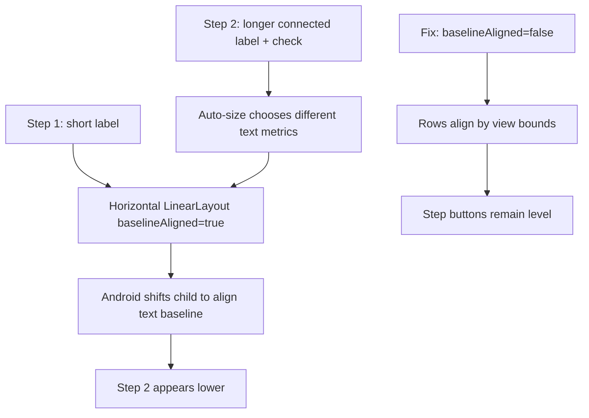

# v1.4.10 — Step button baseline bug

```mermaid
flowchart TD
    A[Step 1: short label]
    B[Step 2: longer connected label + check]
    C[Auto-size chooses different text metrics]
    D[Horizontal LinearLayout baselineAligned=true]
    E[Android shifts child to align text baseline]
    F[Step 2 appears lower]

    A --> D
    B --> C --> D --> E --> F

    G[Fix: baselineAligned=false]
    H[Rows align by view bounds]
    I[Step buttons remain level]

    G --> H --> I
```
