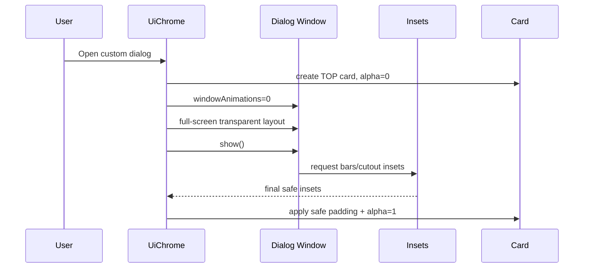

# v1.4.11 — Custom dialog pipeline

```mermaid
sequenceDiagram
    participant U as User
    participant C as UiChrome
    participant W as Dialog Window
    participant I as Insets
    participant V as Card
    U->>C: Open custom dialog
    C->>V: create TOP card, alpha=0
    C->>W: windowAnimations=0
    C->>W: full-screen transparent layout
    C->>W: show()
    W->>I: request bars/cutout insets
    I-->>C: final safe insets
    C->>V: apply safe padding + alpha=1
```
