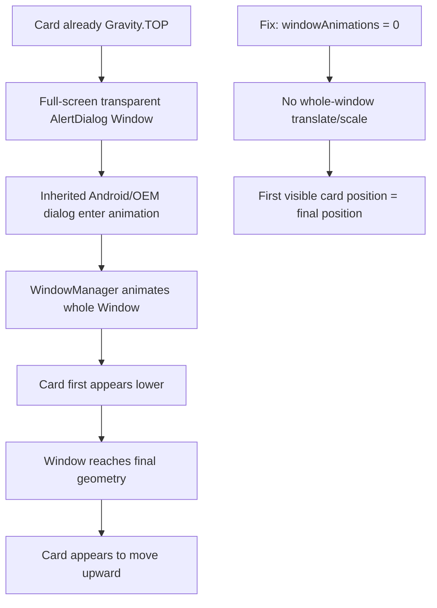

# v1.4.11 — Video root cause

```mermaid
flowchart TD
    A[Card already Gravity.TOP] --> B[Full-screen transparent AlertDialog Window]
    B --> C[Inherited Android/OEM dialog enter animation]
    C --> D[WindowManager animates whole Window]
    D --> E[Card first appears lower]
    E --> F[Window reaches final geometry]
    F --> G[Card appears to move upward]
    H[Fix: windowAnimations = 0] --> I[No whole-window translate/scale]
    I --> J[First visible card position = final position]
```
