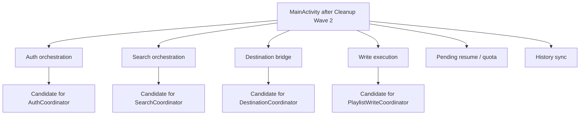

# v1.4.12 — Next extraction targets

```mermaid
flowchart TD
    M[MainActivity after Cleanup Wave 2]

    M --> A[Auth orchestration]
    M --> S[Search orchestration]
    M --> D[Destination bridge]
    M --> W[Write execution]
    M --> Q[Pending resume / quota]
    M --> H[History sync]

    A --> N1[Candidate for AuthCoordinator]
    S --> N2[Candidate for SearchCoordinator]
    D --> N3[Candidate for DestinationCoordinator]
    W --> N4[Candidate for PlaylistWriteCoordinator]
```

Cleanup Wave 3 should extract one responsibility at a time and keep the
existing phone-tested result contracts.
