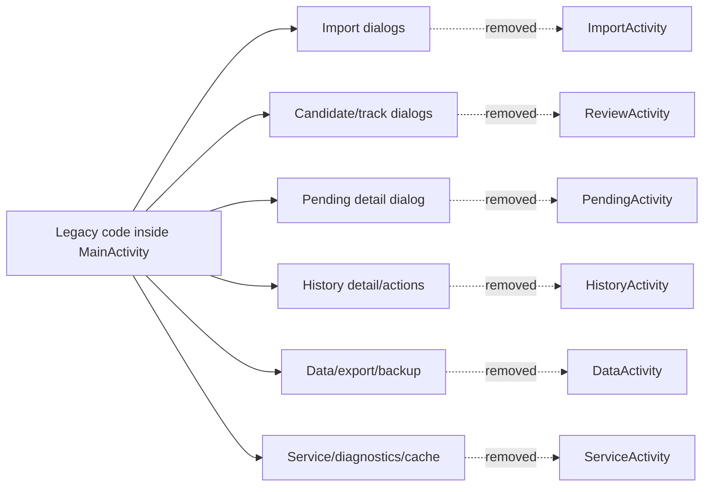

# v1.4.12 — Removed legacy flows

```mermaid
flowchart LR
    L[Legacy code inside MainActivity]

    L --> LI[Import dialogs]
    L --> LR[Candidate/track dialogs]
    L --> LP[Pending detail dialog]
    L --> LH[History detail/actions]
    L --> LD[Data/export/backup]
    L --> LS[Service/diagnostics/cache]

    LI -. removed .-> I[ImportActivity]
    LR -. removed .-> R[ReviewActivity]
    LP -. removed .-> P[PendingActivity]
    LH -. removed .-> H[HistoryActivity]
    LD -. removed .-> D[DataActivity]
    LS -. removed .-> S[ServiceActivity]
```

The dedicated Activity implementations already existed before v1.4.12.
This release removes the obsolete duplicate implementations from MainActivity.
