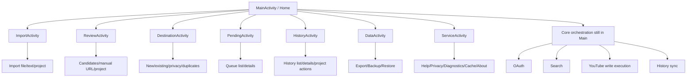

# v1.4.12 — Screen ownership

```mermaid
flowchart TD
    M[MainActivity / Home]

    M --> I[ImportActivity]
    M --> R[ReviewActivity]
    M --> D[DestinationActivity]
    M --> P[PendingActivity]
    M --> H[HistoryActivity]
    M --> DA[DataActivity]
    M --> S[ServiceActivity]

    I --> IW[Import file/text/project]
    R --> RW[Candidates/manual URL/project]
    D --> DW[New/existing/privacy/duplicates]
    P --> PW[Queue list/details]
    H --> HW[History list/details/project actions]
    DA --> DAw[Export/Backup/Restore]
    S --> SW[Help/Privacy/Diagnostics/Cache/About]

    M --> C[Core orchestration still in Main]
    C --> A[OAuth]
    C --> SE[Search]
    C --> W[YouTube write execution]
    C --> HR[History sync]
```
