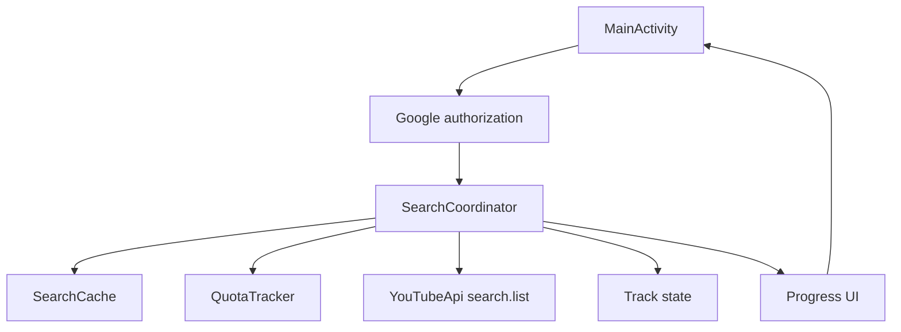

# v1.4.13 — SearchCoordinator architecture

```mermaid
flowchart TD
    M[MainActivity]
    A[Google authorization]
    U[Progress UI]

    C[SearchCoordinator]
    SC[SearchCache]
    Q[QuotaTracker]
    API[YouTubeApi search.list]
    T[Track state]

    M --> A
    A --> C
    C --> SC
    C --> Q
    C --> API
    C --> T
    C --> U
    U --> M
```

MainActivity is the Android UI/auth bridge. SearchCoordinator owns the
search-domain decisions and mutations.
