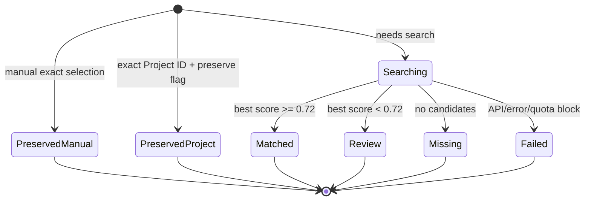

# v1.4.13 — Search state machine

```mermaid
stateDiagram-v2
    [*] --> PreservedManual: manual exact selection
    [*] --> PreservedProject: exact Project ID + preserve flag
    [*] --> Searching: needs search

    Searching --> Matched: best score >= 0.72
    Searching --> Review: best score < 0.72
    Searching --> Missing: no candidates
    Searching --> Failed: API/error/quota block

    PreservedManual --> [*]
    PreservedProject --> [*]
    Matched --> [*]
    Review --> [*]
    Missing --> [*]
    Failed --> [*]
```
