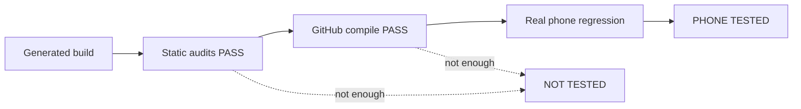

# v1.4.13 — Release test-status rule

```mermaid
flowchart LR
    B[Generated build]
    S[Static audits PASS]
    G[GitHub compile PASS]
    P[Real phone regression]
    T[PHONE TESTED]

    B --> S --> G --> P --> T

    S -. not enough .-> N[NOT TESTED]
    G -. not enough .-> N
```

v1.4.12 is explicitly recorded as NOT TESTED.
