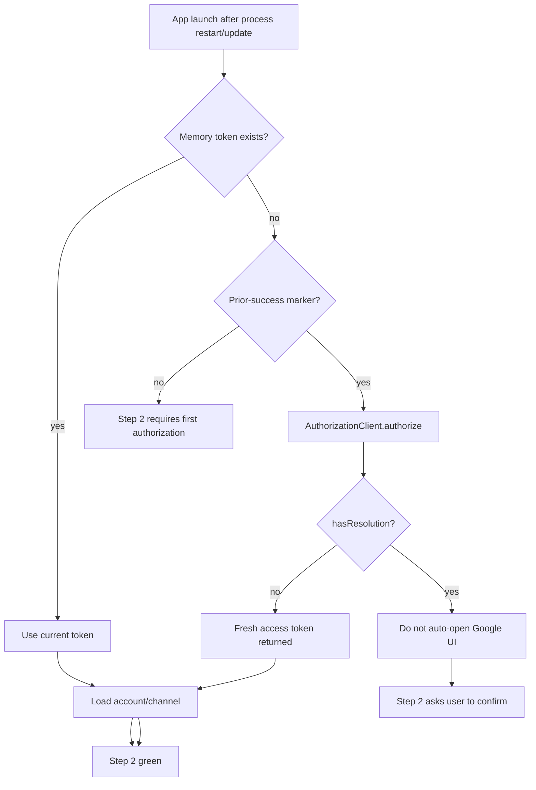

# v1.4.14 — Authorization recovery after update

```mermaid
flowchart TD
    A[App launch after process restart/update]
    B{Memory token exists?}
    C[Use current token]
    D{Prior-success marker?}
    E[Step 2 requires first authorization]
    F[AuthorizationClient.authorize]
    G{hasResolution?}
    H[Fresh access token returned]
    I[Do not auto-open Google UI]
    J[Step 2 asks user to confirm]
    K[Load account/channel]
    L[Step 2 green]

    A --> B
    B -->|yes| C --> K --> L
    B -->|no| D
    D -->|no| E
    D -->|yes| F
    F --> G
    G -->|no| H --> K --> L
    G -->|yes| I --> J
```

Only the non-secret prior-success boolean is persisted by YTM Importer.
