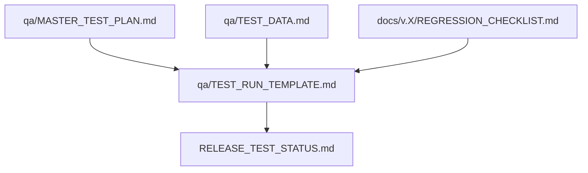

# v1.4.14 — QA document model

```mermaid
flowchart TD
    MASTER[qa/MASTER_TEST_PLAN.md]
    DATA[qa/TEST_DATA.md]
    RUN[qa/TEST_RUN_TEMPLATE.md]
    RELEASE[docs/v.X/REGRESSION_CHECKLIST.md]
    STATUS[RELEASE_TEST_STATUS.md]

    MASTER --> RUN
    DATA --> RUN
    RELEASE --> RUN
    RUN --> STATUS
```

`MASTER_TEST_PLAN` is global.
Versioned regression files contain only release-specific/carry-forward focus.
