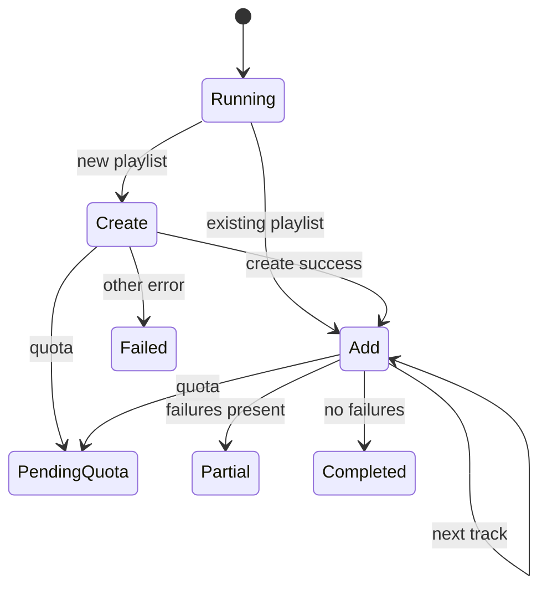

# Write state flow

```mermaid
stateDiagram-v2
    [*] --> Running
    Running --> Create: new playlist
    Running --> Add: existing playlist
    Create --> Add: create success
    Create --> PendingQuota: quota
    Create --> Failed: other error
    Add --> Add: next track
    Add --> PendingQuota: quota
    Add --> Partial: failures present
    Add --> Completed: no failures
```
