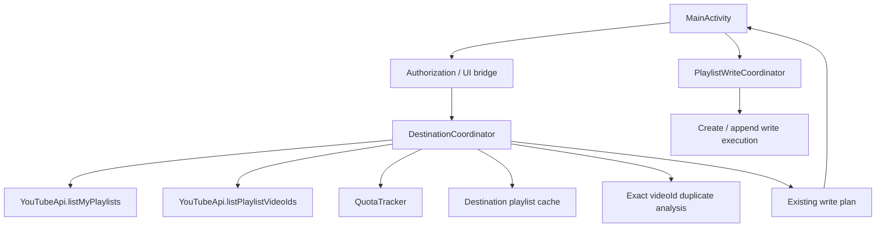

# DestinationCoordinator

```mermaid
flowchart TD
    M[MainActivity] --> AUTH[Authorization / UI bridge]
    AUTH --> DC[DestinationCoordinator]
    DC --> API1[YouTubeApi.listMyPlaylists]
    DC --> API2[YouTubeApi.listPlaylistVideoIds]
    DC --> Q[QuotaTracker]
    DC --> CACHE[Destination playlist cache]
    DC --> DUP[Exact videoId duplicate analysis]
    DC --> PLAN[Existing write plan]
    PLAN --> M
    M --> PWC[PlaylistWriteCoordinator]
    PWC --> WRITE[Create / append write execution]
```
