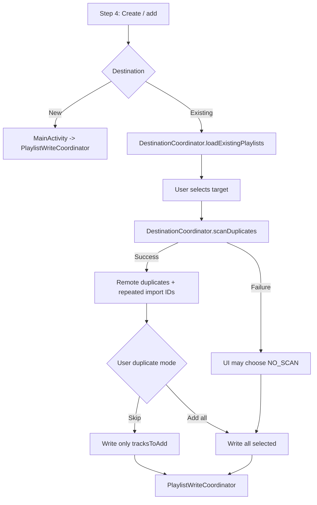

# Destination flow

```mermaid
flowchart TD
    START[Step 4: Create / add] --> CHOICE{Destination}
    CHOICE -->|New| NEW[MainActivity -> PlaylistWriteCoordinator]
    CHOICE -->|Existing| LIST[DestinationCoordinator.loadExistingPlaylists]
    LIST --> SELECT[User selects target]
    SELECT --> SCAN[DestinationCoordinator.scanDuplicates]
    SCAN -->|Success| ANALYSIS[Remote duplicates + repeated import IDs]
    SCAN -->|Failure| NOSCAN[UI may choose NO_SCAN]
    ANALYSIS --> MODE{User duplicate mode}
    MODE -->|Skip| SKIP[Write only tracksToAdd]
    MODE -->|Add all| ALL[Write all selected]
    NOSCAN --> ALL
    SKIP --> WRITE[PlaylistWriteCoordinator]
    ALL --> WRITE
```
