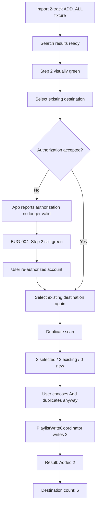

# v1.4.16 — G-07 and stale-auth state flow

## QA conclusion

- G-07 ADD_ALL: PASS
- stale authorization readiness indicator: FAIL / BUG-004
- DestinationCoordinator itself recovered normally after re-authorization
