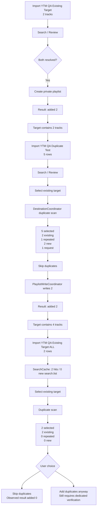

# v1.4.16 phone QA flow

## Interpretation

The observed flow confirms the main v1.4.16 extraction boundary:

`MainActivity / DestinationActivity` → `DestinationCoordinator` → duplicate analysis / quota accounting / write plan → `PlaylistWriteCoordinator`

G-07 ADD_ALL remains an explicit remaining test, not an assumed PASS.
