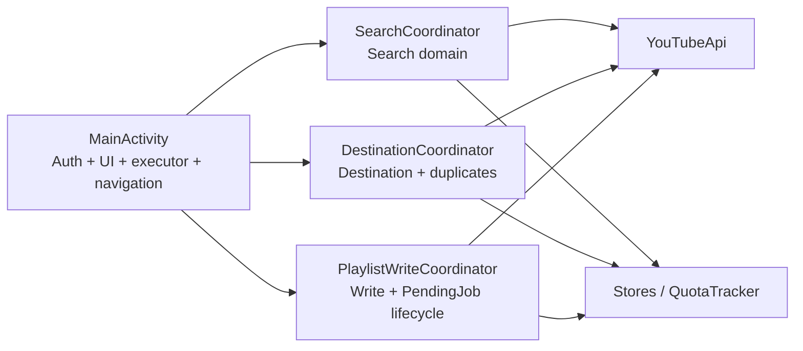

# Responsibility split after v1.4.16

```mermaid
flowchart LR
    UI[MainActivity\nAuth + UI + executor + navigation]
    SEARCH[SearchCoordinator\nSearch domain]
    DEST[DestinationCoordinator\nDestination + duplicates]
    WRITE[PlaylistWriteCoordinator\nWrite + PendingJob lifecycle]
    API[YouTubeApi]
    STORES[Stores / QuotaTracker]

    UI --> SEARCH
    UI --> DEST
    UI --> WRITE
    SEARCH --> API
    SEARCH --> STORES
    DEST --> API
    DEST --> STORES
    WRITE --> API
    WRITE --> STORES
```
