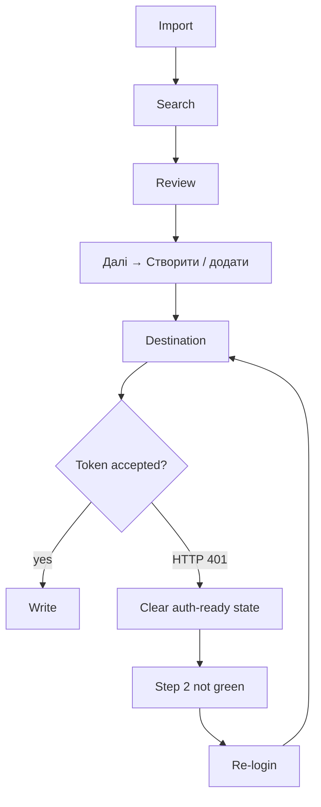

# v1.4.17 flow

```mermaid
flowchart TD
    A[Import] --> B[Search]
    B --> C[Review]
    C --> D[Далі → Створити / додати]
    D --> E[Destination]
    E --> F{Token accepted?}
    F -- yes --> G[Write]
    F -- HTTP 401 --> H[Clear auth-ready state]
    H --> I[Step 2 not green]
    I --> J[Re-login]
    J --> E
```
