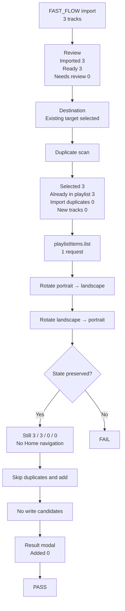

# Phone QA Flow — v1.4.17

```mermaid
flowchart TD
    A[FAST_FLOW import<br/>3 tracks] --> B[Review<br/>Imported 3<br/>Ready 3<br/>Needs review 0]
    B --> C[Destination<br/>Existing target selected]
    C --> D[Duplicate scan]
    D --> E[Selected 3<br/>Already in playlist 3<br/>Import duplicates 0<br/>New tracks 0]
    E --> F[playlistItems.list<br/>1 request]
    F --> G[Rotate portrait → landscape]
    G --> H[Rotate landscape → portrait]
    H --> I{State preserved?}
    I -- Yes --> J[Still 3 / 3 / 0 / 0<br/>No Home navigation]
    I -- No --> X[FAIL]
    J --> K[Skip duplicates and add]
    K --> L[No write candidates]
    L --> M[Result modal<br/>Added 0]
    M --> N[PASS]
```

## Flow result

The tested path ends in **PASS**.
