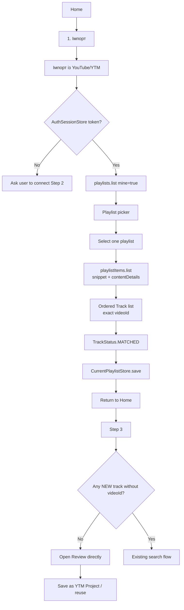

# v1.4.18 G01 — Account Library Import Flow

```mermaid
flowchart TD
    A[Home] --> B[1. Імпорт]
    B --> C[Імпорт із YouTube/YTM]
    C --> D{AuthSessionStore token?}
    D -- No --> E[Ask user to connect Step 2]
    D -- Yes --> F[playlists.list mine=true]
    F --> G[Playlist picker]
    G --> H[Select one playlist]
    H --> I[playlistItems.list<br/>snippet + contentDetails]
    I --> J[Ordered Track list<br/>exact videoId]
    J --> K[TrackStatus.MATCHED]
    K --> L[CurrentPlaylistStore.save]
    L --> M[Return to Home]
    M --> N[Step 3]
    N --> O{Any NEW track without videoId?}
    O -- No --> P[Open Review directly]
    O -- Yes --> Q[Existing search flow]
    P --> R[Save as YTM Project / reuse]
```

The source account playlist is read-only in G01.
