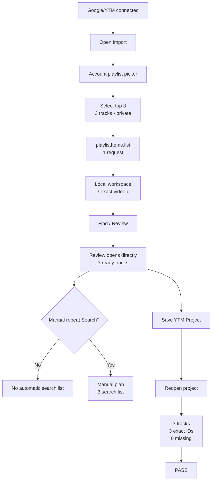

# v1.4.18 — Phone-Tested Account Import Flow

```mermaid
flowchart TD
    A[Google/YTM connected] --> B[Open Import]
    B --> C[Account playlist picker]
    C --> D[Select top 3<br/>3 tracks • private]
    D --> E[playlistItems.list<br/>1 request]
    E --> F[Local workspace<br/>3 exact videoId]
    F --> G[Find / Review]
    G --> H[Review opens directly<br/>3 ready tracks]
    H --> I{Manual repeat Search?}
    I -- No --> J[No automatic search.list]
    I -- Yes --> K[Manual plan<br/>3 search.list]
    H --> L[Save YTM Project]
    L --> M[Reopen project]
    M --> N[3 tracks<br/>3 exact IDs<br/>0 missing]
    N --> O[PASS]
```
