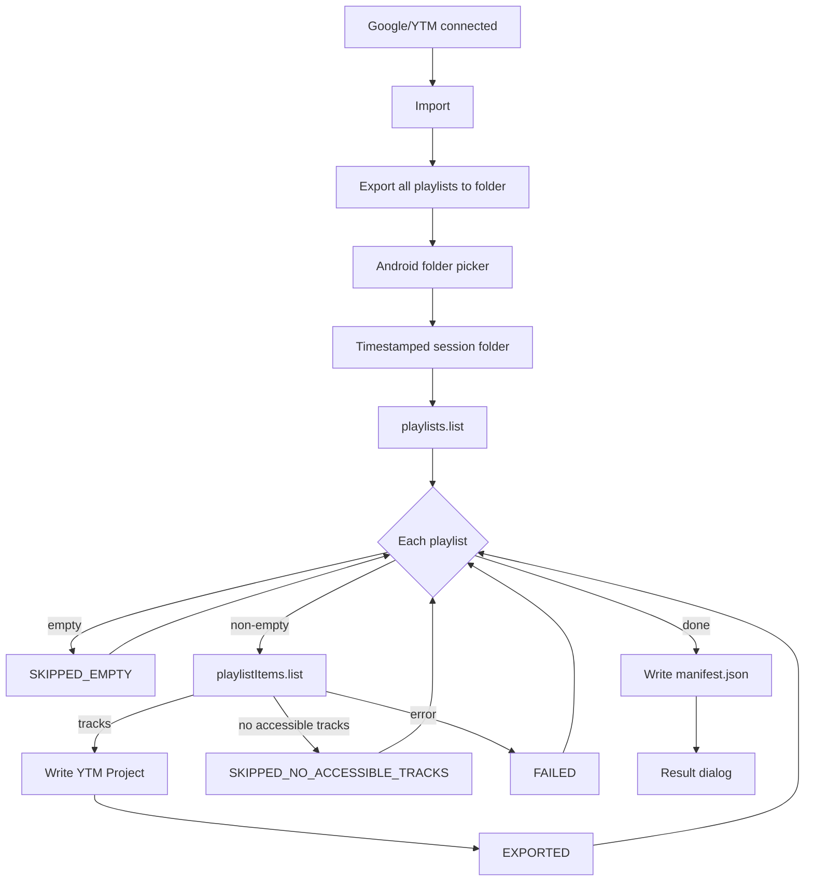

# v1.4.19 — Bulk Account Export Flow

```mermaid
flowchart TD
    A[Google/YTM connected] --> B[Import]
    B --> C[Export all playlists to folder]
    C --> D[Android folder picker]
    D --> E[Timestamped session folder]
    E --> F[playlists.list]
    F --> G{Each playlist}
    G -->|empty| H[SKIPPED_EMPTY]
    G -->|non-empty| I[playlistItems.list]
    I -->|tracks| J[Write YTM Project]
    J --> K[EXPORTED]
    I -->|no accessible tracks| L[SKIPPED_NO_ACCESSIBLE_TRACKS]
    I -->|error| M[FAILED]
    H --> G
    K --> G
    L --> G
    M --> G
    G -->|done| N[Write manifest.json]
    N --> O[Result dialog]
```

This flow does not write to the remote account.
