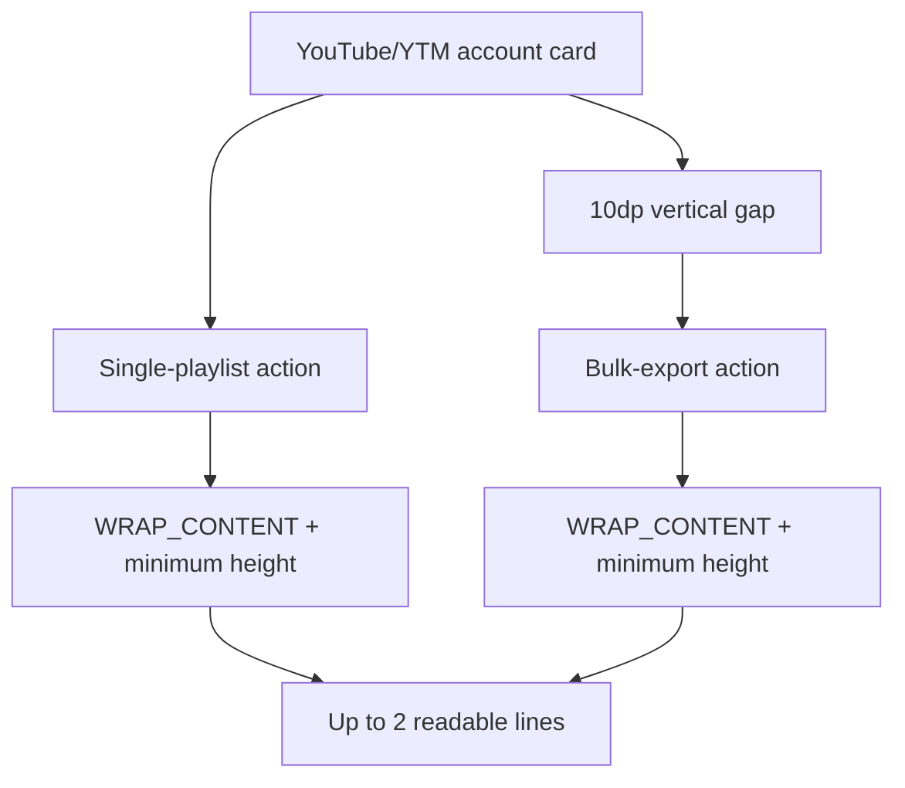

# v1.4.20 — Account Import Action Layout

```mermaid
flowchart TD
    A[YouTube/YTM account card] --> B[Single-playlist action]
    A --> C[10dp vertical gap]
    C --> D[Bulk-export action]
    B --> E[WRAP_CONTENT + minimum height]
    D --> F[WRAP_CONTENT + minimum height]
    E --> G[Up to 2 readable lines]
    F --> G
```

The patch changes layout only; it does not change the account-import/export API flow.
