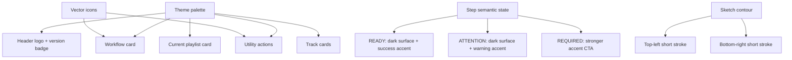

# v1.4.22 — Home Visual Structure

```mermaid
flowchart TD
    A[Theme palette] --> B[Header logo + version badge]
    A --> C[Workflow card]
    A --> D[Utility actions]
    A --> E[Current playlist card]
    A --> F[Track cards]

    G[Vector icons] --> C
    G --> D

    H[Step semantic state] --> I[READY: dark surface + success accent]
    H --> J[ATTENTION: dark surface + warning accent]
    H --> K[REQUIRED: stronger accent CTA]

    L[Sketch contour] --> M[Top-left short stroke]
    L --> N[Bottom-right short stroke]
```

This is a polish step toward the approved three-theme concept, not the final navigation redesign.
