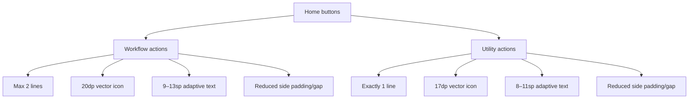

# v1.4.23 — Button fit rules

```mermaid
flowchart TD
    A[Home buttons] --> B[Workflow actions]
    A --> C[Utility actions]

    B --> D[Max 2 lines]
    B --> E[20dp vector icon]
    B --> F[9–13sp adaptive text]
    B --> G[Reduced side padding/gap]

    C --> H[Exactly 1 line]
    C --> I[17dp vector icon]
    C --> J[8–11sp adaptive text]
    C --> K[Reduced side padding/gap]
```
