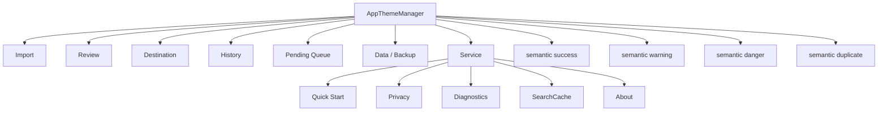

# v1.4.24 — Theme Wave 2 scope

```mermaid
flowchart TD
    A[AppThemeManager] --> B[Import]
    A --> C[Review]
    A --> D[Destination]
    A --> E[History]
    A --> F[Pending Queue]
    A --> G[Data / Backup]
    A --> H[Service]
    H --> I[Quick Start]
    H --> J[Privacy]
    H --> K[Diagnostics]
    H --> L[SearchCache]
    H --> M[About]

    A --> N[semantic success]
    A --> O[semantic warning]
    A --> P[semantic danger]
    A --> Q[semantic duplicate]
```
